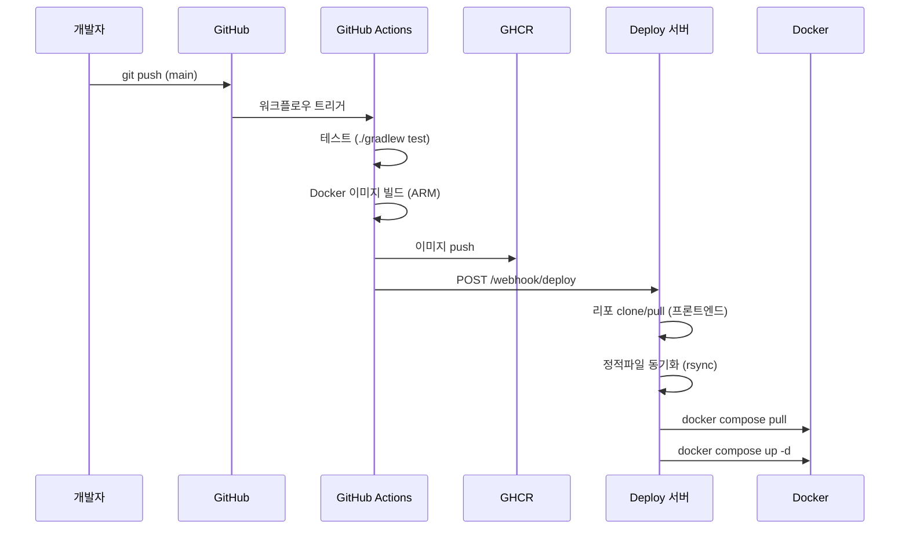
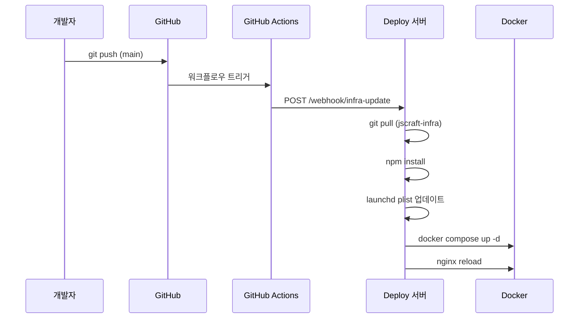
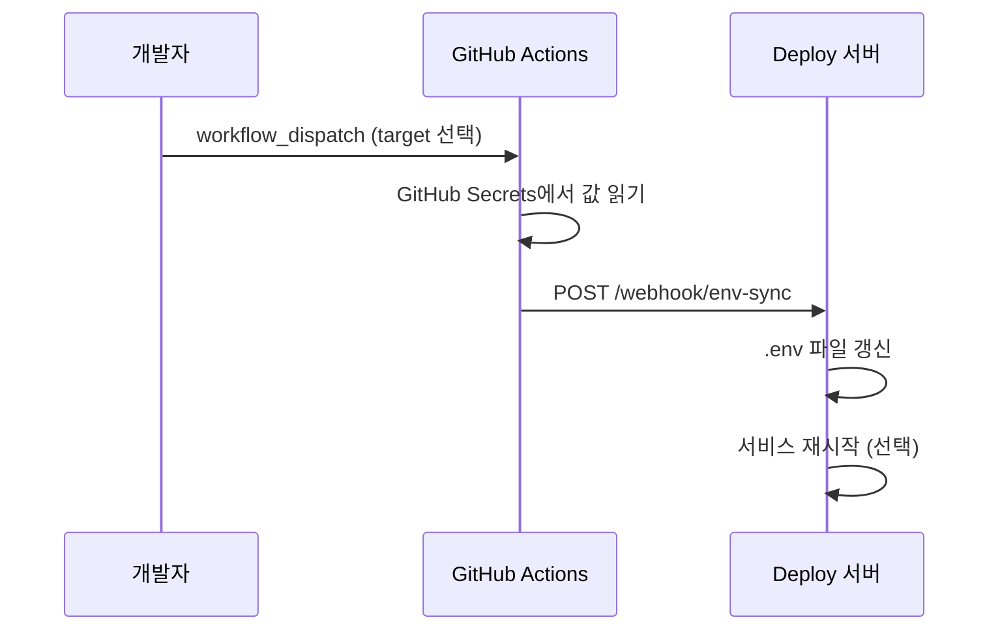

# 배포 구조 및 프로세스

## 전체 아키텍처

```
                        ┌─────────────────────────────────────┐
                        │           Cloudflare                │
                        │   DNS + SSL + CDN (Zero Trust)      │
                        └──────────────┬──────────────────────┘
                                       │
                              cloudflared 터널
                                       │
                        ┌──────────────┴──────────────────────┐
                        │           서버 (호스트)               │
                        │                                     │
                        │  ┌─────────────┐  ┌──────────────┐  │
                        │  │ cloudflared │  │ deploy 서버   │  │
                        │  │ (launchd)   │  │ (launchd)    │  │
                        │  │             │  │ :4000        │  │
                        │  └──────┬──────┘  └──────────────┘  │
                        │         │                           │
                        │  ┌──────┴───────────────────────┐   │
                        │  │         Docker          │   │
                        │  │                               │   │
                        │  │  ┌──────────┐ ┌───────────┐  │   │
                        │  │  │ postgres │ │   redis   │  │   │
                        │  │  │  :5432   │ │   :6379   │  │   │
                        │  │  └──────────┘ └───────────┘  │   │
                        │  │                               │   │
                        │  │  ┌──────────┐ ┌───────────┐  │   │
                        │  │  │  nginx   │ │  bj-auth  │  │   │
                        │  │  │  :8080   │ │  :9000    │  │   │
                        │  │  └──────────┘ └───────────┘  │   │
                        │  │                               │   │
                        │  │  ┌──────────────────────┐    │   │
                        │  │  │  bj-tetris-server    │    │   │
                        │  │  │  :9001               │    │   │
                        │  │  └──────────────────────┘    │   │
                        │  │                               │   │
                        │  └───────────────────────────────┘   │
                        └──────────────────────────────────────┘
```

## 도메인 라우팅

```
auth.jscraft.work        → cloudflared → localhost:9000 (bj-auth)
tetris.jscraft.work      → cloudflared → localhost:8080 (Nginx → 정적파일)
tetris-api.jscraft.work  → cloudflared → localhost:9001 (bj-tetris-server)
deploy.jscraft.work      → cloudflared → localhost:4000 (deploy 서버)
alt.jscraft.work         → cloudflared → localhost:8080 (Nginx → 정적파일 + API 프록시)
```

## CI/CD 파이프라인

### 앱 배포 (bj-auth, bj-tetris)



### 인프라 배포 (jscraft-infra)



### 환경변수 동기화 (수동 트리거)



## 서비스 구성

### 호스트 서비스 (launchd)

| 서비스 | plist | 역할 |
|--------|-------|------|
| cloudflared | com.cloudflare.cloudflared | Cloudflare 터널 |
| deploy 서버 | com.jscraft.deploy | 배포 웹훅 수신 |

### Docker 서비스

| 서비스 | compose 위치 | 이미지 |
|--------|-------------|--------|
| PostgreSQL | infra/ | postgres:16 |
| Redis | infra/ | redis:7-alpine |
| Nginx | infra/ | nginx:alpine |
| bj-auth | apps/bj-auth/ | ghcr.io/jscraft-work/bj-auth |
| bj-tetris-server | apps/bj-tetris/ | ghcr.io/jscraft-work/bj-tetris-server |

### Docker 네트워크

모든 컨테이너는 `jscraft` 네트워크를 공유하여 컨테이너 이름으로 통신합니다.

```
bj-tetris-server → bj-auth:9000   (OAuth 토큰/유저정보 내부 호출)
bj-auth          → postgres:5432  (DB)
bj-tetris-server → postgres:5432  (DB)
nginx            → host.docker.internal:8000 (alt-fast API 프록시)
```

## GitHub Secrets (Organization)

`jscraft-work` org에서 관리. 모든 리포에서 공유.

| Secret | 용도 |
|--------|------|
| WEBHOOK_SECRET | Deploy 웹훅 HMAC 서명 |
| DEPLOY_WEBHOOK_URL | Deploy 서버 URL |
| DB_USERNAME | PostgreSQL 유저 |
| DB_PASSWORD | PostgreSQL 비밀번호 |
| GHCR_OWNER | GitHub Container Registry 소유자 |
| CORS_ALLOWED_ORIGINS | CORS 허용 도메인 |
| OAUTH_REDIRECT_URI | OAuth 리다이렉트 URI |
| OAUTH_POST_LOGOUT_REDIRECT_URI | 로그아웃 후 리다이렉트 |
| AUTH_ISSUER | OAuth 인증 서버 URL |
| FRONTEND_BASE_URL | 프론트엔드 URL |
| ALT_FAST_DIST | alt-fast 프론트 빌드 경로 |

## 초기 세팅

```bash
./setup.sh
```

setup.sh가 처리하는 것:
1. `/opt/jscraft` 디렉토리 생성
2. jscraft-infra 리포 clone
3. .env 파일 생성 (example 복사)
4. deploy 서버 npm install
5. deploy 서버 launchd 등록
6. Docker 네트워크 생성

수동으로 해야 하는 것:
- .env 파일 값 채우기
- cloudflared config ingress 추가
- Docker 볼륨 마운트 경로 확인

## 관리 명령어

```bash
make help              # 전체 명령어 목록
make up                # 전체 서비스 시작
make down              # 전체 서비스 중지
make health            # 헬스체크
make deploy-auth       # bj-auth 배포 (pull + restart)
make deploy-tetris     # bj-tetris 배포 (pull + restart)
make cloudflared-restart  # 터널 재시작
make logs svc=bj-auth  # 로그 보기
```
